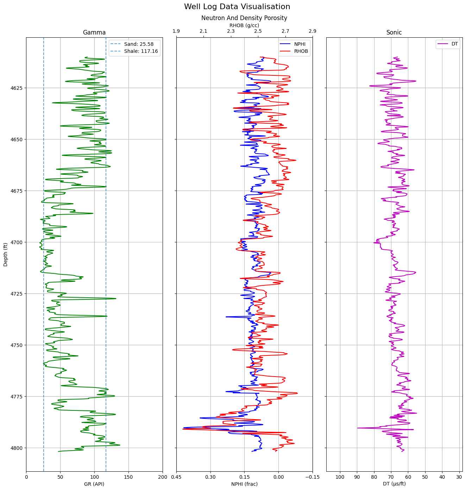

# Well Data Visualisation and Shale Volume Estimation

### Project Overview
Developed Python-based tools for visualizing well log data, creating clear multi-track plots for Gamma Ray, Neutron Porosity, Density, and Sonic logs. Implemented interactive functionality to calculate and display shale volume (Vshale) at specific depths, enhancing petrophysical analysis.

### Data Sources
WellData : It includes well log data of depth, gamma ray, sonic log, density log and neutron porosity.

### Tools
Numpy, Pandas & Matplotlib

### Data Visualization 

